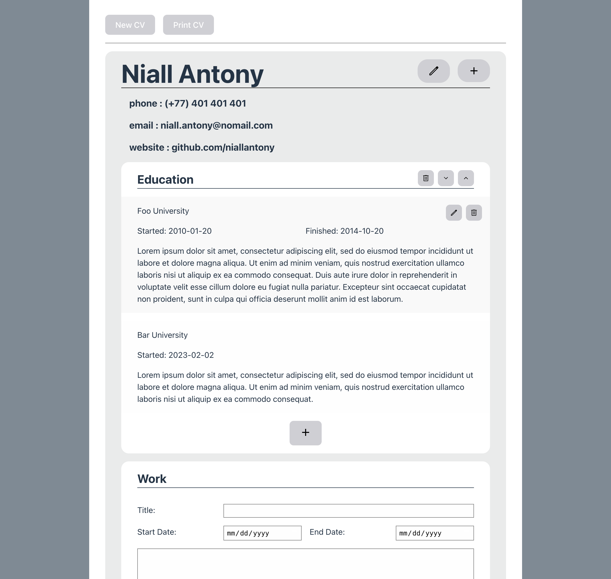
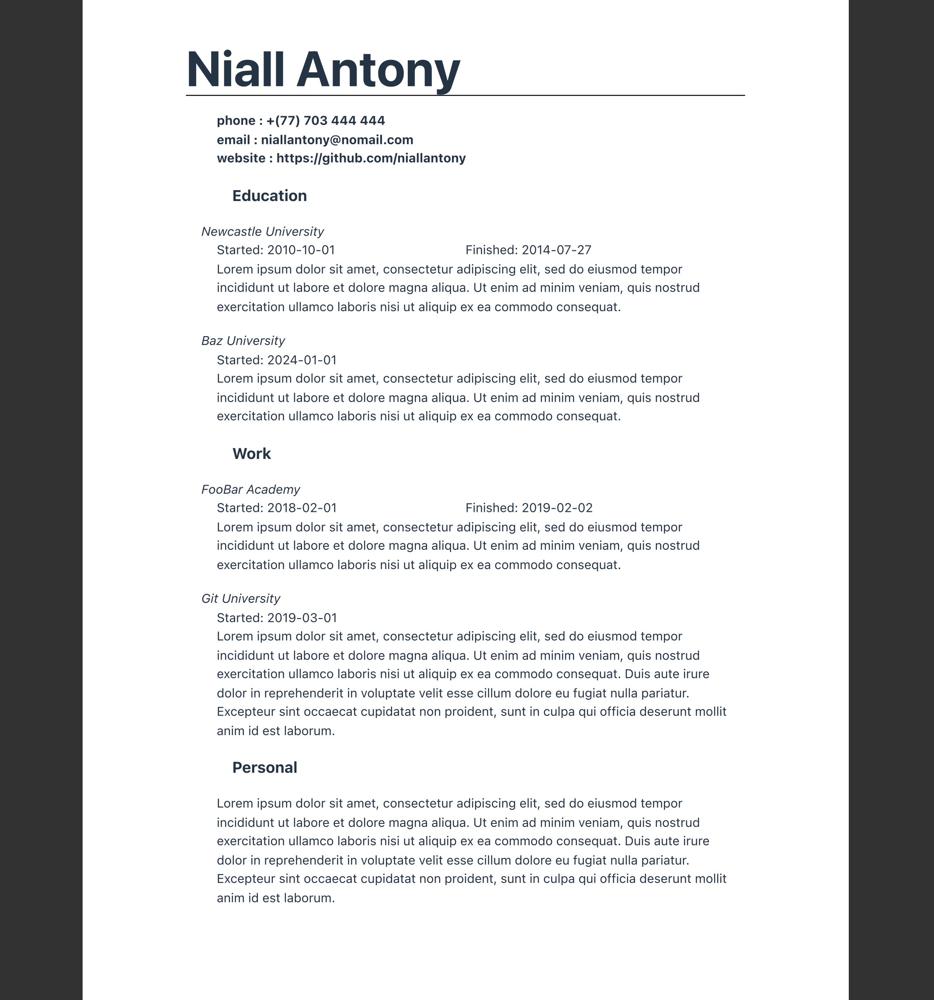

# CV Builder Application

## A first React application

This application was made for *The Odin Project*'s React course, specifically to learn the use of the useState hook, and construction of an ordered website. While I tried to plan as much as possible at the start of this project, because of my lack of experience with React, I really didn't know the best way to split it down into components, probably something that I am going to be able to do much better going forwards. As such, a lot of my component names are also not too descriptive, which is something I plan to fix as well.

## Features

It is a fairly simple application for constructing a standard CV. It is initiated with information such as name and phone number, then sections can be added for Work, Education, etc. Within the sections information can be added with a few fields of input.

Each section can be deleted and re-ordered upon the CV.

Each piece of information can also be edited, deleted, and is automatically placed in chronological order.

At the end the CV can be printed using the Print CV button which formats it accordingly.

## Possible To-Dos

- [ ] More comprehensive and cohesive CSS styling
- [ ] Form animations
- [ ] Saving and loading of CVs

## Images

| Screen View | Print View |
| ------------| -----------|
|  |   |